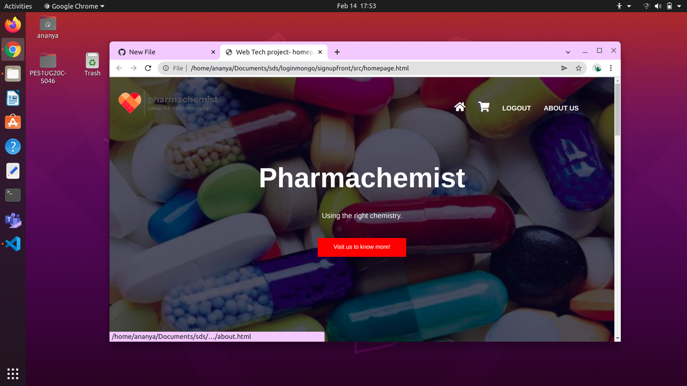
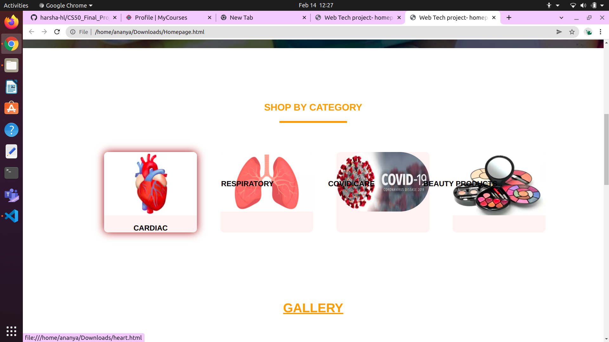
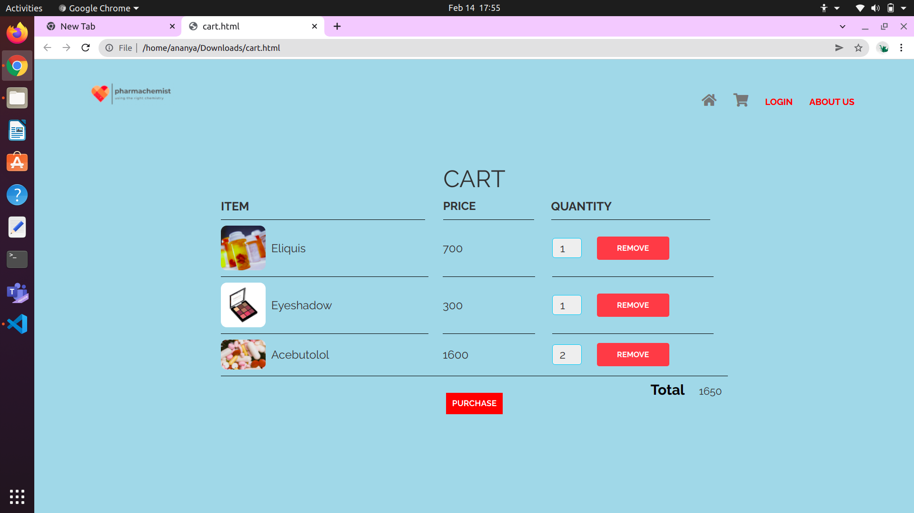
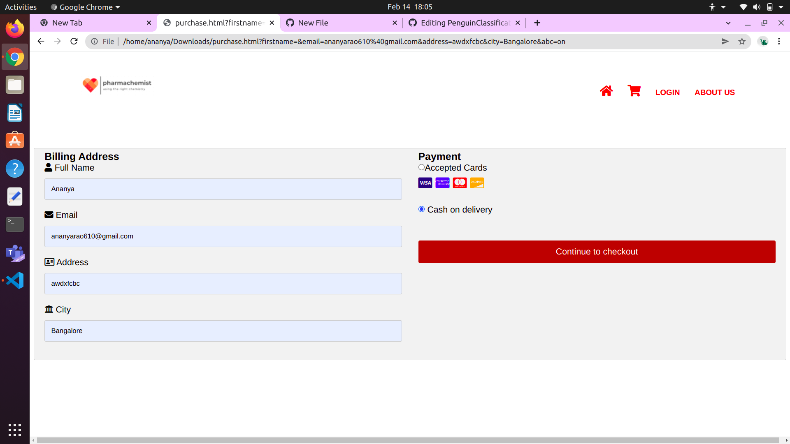

# Pharmachemist

## Introduction

The Pharmachemist shopping website is a web based application designed using HTML, CSS and JS. MongoDB has been used as the database. 
It mimics a medicine shopping site where the users can register, login and buy medicine and skincare products.

## View

The below images will give you a glimpse of the application / site which a user will be exposed to. Most of the components, hover effects, transisitons and gradients have been implemented using plain css and javascript with html combining the two to make the webpages. Also certain features like navigation bars and alerts have been designed using Bootstrap 4. The user will be able to view products by category, add them to cart, review the prices, select the number of products they wish to order and also mimic a payment showing the completion of transaction. They will also be able to view their cart items and order history at any given moment.

## Backend

The login/signup has a database which stores user name, email id and passwod. If the user does not have an account, it can be created using signup. Care has been taken so as to prevent users from performing injection attacks and are also prevented from entering invalid data at any of the fields on the site so as to make it reliable.
Another database is created for the cart. The name of the product added to cart, number of items are stored. The cart page allows you to add or remove items and it gets dynamically updated in the mongodb collection. 
